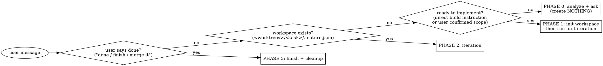

# Feature workspace mode

## Overview

Invoked **once**, this skill puts you into **Feature Mode for the rest of the session**: every
feature/fix is built in an isolated git-worktree workspace under `<worktrees_dir>/<task>/`, on its
own unique port, and lands in its base branch via a PR. You do not re-invoke it per step — the
conversation itself drives the phases.

**Invoke it yourself, proactively.** The moment a request in a configured workspace turns into
building/changing/fixing a feature (not a read-only question), enter this mode *before* writing any
implementation code — don't wait to be asked for `/feature`. If you're already in Feature Mode this
session, stay in it; don't re-enter. On first entry, run the **Preflight** check (below) so a
missing tool or unauthenticated `gh` surfaces before you start building, not mid-iteration.

**Core contract:** by the time you hand the user a summary, the current iteration is already
simplified, committed, pushed, and reflected in the PR. The summary is the *last* thing you produce,
never the first.

## Prerequisite — per-project config

The skill is driven by a per-project config file at the **workspace root**:

```
<workspace-root>/.claude/feature/config.json
```

This file both **defines the workspace** (its presence marks the root that holds the repo checkouts
and the `worktrees/` tree) and **declares the repos** the skill can build in (names, base branches,
port bands, dev-start commands, which deps to symlink). The skill's scripts auto-resolve the root by
walking up from the cwd to the directory that contains this file.

If it's missing when implementation begins, **create it first** (Phase 0) — see
`references/workspace.md` §0 for the schema and a worked example, or the plugin's
[configuration doc](../../../../docs/feature/configuration.md). Minimal shape:

```json
{
  "proxy": { "domain_suffix": "localhost", "admin_port": 7878 },
  "repos": [
    { "name": "api", "base_branch": "main", "port_band": 18000, "frontend": false,
      "deps_symlink": ["venv"], "env_copy": [".env"],
      "dev_start": "venv/bin/python manage.py runserver 0.0.0.0:{port}" },
    { "name": "web", "base_branch": "main", "port_band": 13000, "frontend": true,
      "deps_symlink": ["node_modules"], "env_copy": [".env", ".env.local"],
      "dev_start": "node_modules/.bin/next dev -p {port}" }
  ]
}
```

A repo's **checkout folder name == its `name`**, directly under the workspace root.

### Standing instructions (optional)

Rules that hold for **every** iteration live next to the config and are applied by the `iteration`
skill (its step 0) whenever they exist — never restate them per request:

- `<workspace-root>/.claude/feature/INSTRUCTIONS.md` — free-form markdown, injected verbatim.
- config `instructions` / `repos[].instructions` — arrays of strings (per-repo rules apply only when
  that repo is touched).

They are **constraints**, not a checklist: unlike `considerations`, they're never reported per item.
Don't create them proactively — add them only when the user states a recurring rule.

## Script paths

All scripts ship inside this skill. Reference them via the skill dir so they work regardless of where
the plugin is installed:

```bash
SCRIPTS="${CLAUDE_SKILL_DIR}/scripts"          # e.g. ${CLAUDE_PLUGIN_ROOT}/skills/feature/scripts
```

They self-anchor to the workspace root (via `.claude/feature/config.json`); pass `--root "$ROOT"`
when you want to be explicit.

## When to use / not

- **Use** when starting or continuing a change in the configured repos that should be reviewed/merged
  via a PR.
- **Don't use** for read-only questions, DB inspection, ops tasks, or one-off edits the user
  explicitly wants applied directly to the base branch.

## Modes — full (default) vs `--lite`

Decide the mode once, at the start, and record it in `.feature.json` (`"mode"`); it holds for the
whole session.

- **full** (default) — allocate a unique port, run the dev server(s), wire FE→BE, refresh the proxy,
  and give a pretty `http://<task>.<suffix>` URL each iteration. Servers are started **detached** via
  `scripts/serve.py` so they outlive a one-shot `claude -p` turn, and `scripts/reap.py` (run at the
  top of every iteration) caps live servers and tears down workspaces whose PR has merged — so they
  don't pile up.
- **`--lite`** — **no ports, no dev servers, no FE→BE wiring, no manual-test block.** Everything else
  is identical: worktree, dependency symlinks, simplify, commit, push, PR, recommendations.

**Lite is opt-in.** Enter lite mode **only** when the user explicitly passes the `--lite` flag. Never
infer it, never choose it yourself — not from the task shape (backend-only, config, docs, refactor),
not from phrasing like "quick"/"just a PR", and not when you invoke Feature Mode proactively. Absent
an explicit `--lite` from the user, the mode is always **full**.

## Preflight — verify the toolchain before building

The **first time** you enter Feature Mode in a session, run the doctor once and act on what it
finds (it's read-only — safe to run anytime):

```bash
python3 "${CLAUDE_SKILL_DIR}/scripts/doctor.py"        # add --root "$ROOT" and/or --mode lite
```

It checks git, the GitHub CLI (`gh` **installed and authenticated**), the workspace config (plus a
line naming the standing instructions in force, when any), each
repo's checkout + dependency dirs, and — in full mode — Caddy for pretty URLs. Every problem is
tagged with an owner, and you split the work accordingly:

- **`[agent]` — do it yourself now, then continue.** Low-risk, non-privileged fixes: create
  `.claude/feature/config.json` (Phase 0), `brew install gh` if missing (say you're doing it).
- **`[user]` — you can't; relay the exact command verbatim** and wait if it's blocking: `gh auth
  login` (interactive), `proxy-setup.sh` (sudo / binds `:80`), cloning a missing repo, installing a
  repo's dev dependencies.

Exit `1` means a `[user]` action blocks building — surface those lines and don't push ahead on the
affected repo until they're resolved. Warnings (dev-server deps, Caddy) are non-blocking — `--lite`
and plain commits still work; just tell the user how to enable the missing bit. Re-run the doctor
after the user reports done. Once per session (or when something looks off) is enough — not every
iteration.

## Operating mode — phase detection

On every user message while in Feature Mode, decide the phase:



- **Phase 0 — Analyze.** Run the **Preflight** doctor (above) if you haven't this session, and
  handle its findings — do the `[agent]` fixes, relay the `[user]` ones. Understand the request,
  inspect the relevant repos, ask clarifying questions. Ensure `.claude/feature/config.json` exists
  (create it if not — see `references/workspace.md` §0). Create nothing else yet. Decide which repos
  are involved and a short kebab-case `<task>` slug.
- **Phase 1 — Init workspace** (lazy, only when implementation actually begins). See
  `references/workspace.md`, then immediately run the first iteration.
- **Phase 2 — Iteration** (every subsequent prompt/edit): reap, then run the **`iteration` skill**.
  See `references/iterate.md`.
- **Phase 3 — Finish** (only on explicit user go-ahead). See `references/finish.md`.

## The iteration contract — delegated to the `iteration` skill

Phase 2 does **not** re-implement the per-change contract — it is owned by the **`iteration` skill**
(the single source of truth): **pick up PR feedback** → implement → **simplify** → **review** →
commit → push → **PR** → **answer the threads** → **considerations** → test links, with the chat
summary **last**.
Each Phase 2 turn is just:

1. **Reap** stale workspaces (`iterate.md` §0) — feature-only lifecycle housekeeping, every turn.
2. **Invoke the `iteration` skill.** It auto-detects this workspace (a `.feature.json` beside the
   worktree + the config) and therefore uses each repo's configured `base_branch`, spans **all**
   involved repos, persists `summary.md` + stamps the session id for the admin dashboard, and emits
   pretty `http://<task>.<suffix>/…` test links (`--lite` → how-to-verify instead).

Invoking `feature` is the user's pre-authorization for that per-iteration commit/push/PR. The simplify
/ commit-every-iteration / push-before-summary rules live in — and are enforced by — the `iteration`
skill; don't restate them here.

### Red flags — STOP, you are about to break the contract

- About to **edit, commit, or push in a main checkout** (`<workspace-root>/<repo>`) or push straight
  to a base branch → no. All work lives in the `task-<task>` worktree and lands via PR.
- Editing a tracked file (e.g. `package.json`) to change the port → no. Use a CLI flag / copied env
  (see workspace ref).
- Skipping the reap at the top of the turn → no. It's what stops servers/worktrees from piling up.
- About to merge without an explicit user go-ahead → no. Finish is user-triggered only.

## Repos & ports

Everything is declared in `<workspace-root>/.claude/feature/config.json`:

| Config field | Meaning |
|---|---|
| `repos[].name` | repo / checkout folder name (directly under the workspace root) |
| `repos[].base_branch` | branch to fork from and PR into |
| `repos[].port_band` | base port; the allocator gives the next free offset per repo (see `scripts/ports.py`) |
| `repos[].frontend` | `true` ⇒ this repo owns the bare `http://<task>.<suffix>` alias |
| `repos[].deps_symlink` | dirs to symlink from the main checkout (e.g. `node_modules`, `venv`) — never build caches |
| `repos[].env_copy` | `.env*` files to copy (not symlink) into the worktree |
| `repos[].dev_start` | dev-server command, `{port}` placeholder, run relative to the worktree (full mode) |
| `instructions[]` | standing rules every iteration must obey (array of strings); `repos[].instructions` scopes rules to one repo. Companion free-form file: `.claude/feature/INSTRUCTIONS.md` — see `configuration.md` |
| `considerations[]` | cross-cutting dimensions the `iteration` skill validates every iteration (mobile, RTL/i18n, …); each has `name`, `check`, optional `when`/`repos` — see `configuration.md` |
| `pr_feedback` | how the reviewer's PR comments are picked up and answered each iteration (`enabled`, `reply`, `resolve`, …) — on by default; see `configuration.md` |
| `proxy.domain_suffix` | URL suffix for pretty URLs (default `localhost`) |
| `proxy.admin_host` / `admin_port` | admin dashboard host/port |
| `max_live_servers` | reaper cap on concurrent dev servers |

In full mode each server is also reachable port-lessly at `http://<repo>.<task>.<suffix>` (primary
frontend at `http://<task>.<suffix>`) via Caddy — see `references/proxy.md`.

## Phase playbooks

- **Init:** `references/workspace.md` — config schema (§0), worktree creation, dependency symlinks,
  `.env` copy, port allocation, running on the unique port, FE→BE wiring, `.feature.json` state.
- **Iteration:** `references/iterate.md` — reap, then delegate to the **`iteration` skill**, which owns
  the exact simplify→commit→push→PR steps, the considerations block, and the output template.
- **Finish:** `references/finish.md` — sync the base branch into the task branch first (conflicts
  resolved on the task branch in the worktree, so the PR reflects what lands and CI runs on it), wait
  for green CI, then a now-trivial local merge into the base branch + push (which auto-merges the PR
  and updates the local base) + full cleanup.
- **Pretty URLs:** `references/proxy.md` — `http://<task>.<suffix>` via Caddy on `:80` (full mode).
  One-time setup: `scripts/proxy-setup.sh`; per-task reload is sudo-free.
- **Admin dashboard:** `references/admin.md` — launch with **`/feature-admin`** (or
  `scripts/admin.py`); serves a live view of every workspace (repos, PRs+CI, dev-server health & logs,
  summary, `claude --resume` command) at `http://<admin_host>`. Read-only over the skill's state plus
  start/stop/reap buttons; finish stays chat-driven.

## Common mistakes

- Creating the workspace during Phase 0 — wait until implementation actually starts.
- Symlinking `.next`/build caches — those must be per-worktree (symlink only `node_modules`/`venv`,
  i.e. the configured `deps_symlink`).
- Forgetting that one feature can span several repos — init, commit, PR, and finish must cover **all**
  involved repos.
- Re-creating an existing worktree — if `.feature.json` exists, resume from it.
- Leaving dev servers running or ports allocated after finish.
- Starting a dev server with a bare `cmd &` instead of `scripts/serve.py` — under a one-shot
  `claude -p` turn it dies when the turn ends. Always launch through `serve.py`.
- Skipping `reap.py` at the top of an iteration — that's what stops worktrees/servers from
  accumulating; it's cheap and self-throttling, so run it every turn.
