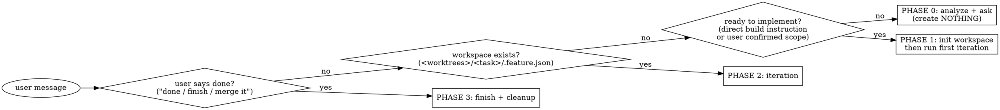

# Feature workspace mode

## Overview

Invoked **once**, this skill puts you into **Feature Mode for the rest of the session**: every
feature/fix is built in an isolated git-worktree workspace under `<worktrees_dir>/<task>/`, on its
own unique port, and lands in its base branch via a PR. You do not re-invoke it per step — the
conversation itself drives the phases.

**Invoke it yourself, proactively.** The moment a request in a configured workspace turns into
building/changing/fixing a feature (not a read-only question), enter this mode *before* writing any
implementation code — don't wait to be asked for `/feature`. If you're already in Feature Mode this
session, stay in it; don't re-enter.

**Core contract:** by the time you hand the user a summary, the current iteration is already
simplified, committed, pushed, and reflected in the PR. The summary is the *last* thing you produce,
never the first.

## Prerequisite — per-project config

The skill is driven by a per-project config file at the **workspace root**:

```
<workspace-root>/.claude/feature/config.json
```

This file both **defines the workspace** (its presence marks the root that holds the repo checkouts
and the `worktrees/` tree) and **declares the repos** the skill can build in (names, base branches,
port bands, dev-start commands, which deps to symlink). The skill's scripts auto-resolve the root by
walking up from the cwd to the directory that contains this file.

If it's missing when implementation begins, **create it first** (Phase 0) — see
`references/workspace.md` §0 for the schema and a worked example, or the plugin's
[configuration doc](../../../../docs/feature/configuration.md). Minimal shape:

```json
{
  "proxy": { "domain_suffix": "localhost", "admin_port": 7878 },
  "repos": [
    { "name": "api", "base_branch": "main", "port_band": 18000, "frontend": false,
      "deps_symlink": ["venv"], "env_copy": [".env"],
      "dev_start": "venv/bin/python manage.py runserver 0.0.0.0:{port}" },
    { "name": "web", "base_branch": "main", "port_band": 13000, "frontend": true,
      "deps_symlink": ["node_modules"], "env_copy": [".env", ".env.local"],
      "dev_start": "node_modules/.bin/next dev -p {port}" }
  ]
}
```

A repo's **checkout folder name == its `name`**, directly under the workspace root.

## Script paths

All scripts ship inside this skill. Reference them via the skill dir so they work regardless of where
the plugin is installed:

```bash
SCRIPTS="${CLAUDE_SKILL_DIR}/scripts"          # e.g. ${CLAUDE_PLUGIN_ROOT}/skills/feature/scripts
```

They self-anchor to the workspace root (via `.claude/feature/config.json`); pass `--root "$ROOT"`
when you want to be explicit.

## When to use / not

- **Use** when starting or continuing a change in the configured repos that should be reviewed/merged
  via a PR.
- **Don't use** for read-only questions, DB inspection, ops tasks, or one-off edits the user
  explicitly wants applied directly to the base branch.

## Modes — full (default) vs `--lite`

Decide the mode once, at the start, and record it in `.feature.json` (`"mode"`); it holds for the
whole session.

- **full** (default) — allocate a unique port, run the dev server(s), wire FE→BE, refresh the proxy,
  and give a pretty `http://<task>.<suffix>` URL each iteration. Servers are started **detached** via
  `scripts/serve.py` so they outlive a one-shot `claude -p` turn, and `scripts/reap.py` (run at the
  top of every iteration) caps live servers and tears down workspaces whose PR has merged — so they
  don't pile up.
- **`--lite`** — **no ports, no dev servers, no FE→BE wiring, no manual-test block.** Everything else
  is identical: worktree, dependency symlinks, simplify, commit, push, PR, recommendations.

**Lite is opt-in.** Enter lite mode **only** when the user explicitly passes the `--lite` flag. Never
infer it, never choose it yourself — not from the task shape (backend-only, config, docs, refactor),
not from phrasing like "quick"/"just a PR", and not when you invoke Feature Mode proactively. Absent
an explicit `--lite` from the user, the mode is always **full**.

## Operating mode — phase detection

On every user message while in Feature Mode, decide the phase:



- **Phase 0 — Analyze.** Understand the request, inspect the relevant repos, ask clarifying questions.
  Ensure `.claude/feature/config.json` exists (create it if not — see `references/workspace.md` §0).
  Create nothing else yet. Decide which repos are involved and a short kebab-case `<task>` slug.
- **Phase 1 — Init workspace** (lazy, only when implementation actually begins). See
  `references/workspace.md`, then immediately run the first iteration.
- **Phase 2 — Iteration** (every subsequent prompt/edit). See `references/iterate.md`.
- **Phase 3 — Finish** (only on explicit user go-ahead). See `references/finish.md`.

## The iteration contract (non-negotiable)

Every iteration, **in this order, before you write the chat summary**:

1. Implement the requested change(s) inside the task worktree(s).
2. **Simplify — mandatory after any significant change.** Run the `/simplify` skill on the files
   changed this iteration (quality only, must not change behavior). Skip it **only** for a genuinely
   *minor* edit — a one-/few-line change with no new or restructured logic (a constant, copy/string,
   type, import, config value, comment, version bump, or a pure revert). Anything that adds/changes
   logic, a component, or touches multiple files is significant → simplify is required. When in
   doubt, run it. Always state the outcome in the summary: `simplify: ✓` or
   `simplify: skipped (minor)` — never omit it silently. (If `/simplify` is not installed, do an
   equivalent manual cleanup pass and say so.)
3. **Considerations — validate every applicable cross-cutting dimension** declared in the config's
   `considerations` list (e.g. mobile, RTL/i18n, cross-browser). For each entry decide applicability
   from its `when`/`repos`, and for every *applicable* one actually verify the change satisfies its
   `check` (don't just assert it). These are recurring blind spots — features get specified for the
   desktop/happy path and the rest is silently forgotten. **Declare an outcome per applicable entry**
   in the summary: `considerations: mobile ✓ · rtl n/a · cross-browser ⚠ (needs Safari check)`. Use
   `✓` (verified), `n/a` (not applicable — say why if non-obvious), or `⚠` (applicable but unverified
   / follow-up needed). Never omit the line when the list is non-empty. (Empty list ⇒ skip silently.)
4. Per involved repo: `git add` only the files you changed → `git commit` → `git push`. **Spell out
   git explicitly.**
5. Ensure the PR exists (create on the first iteration with `--base <base_branch>`; later pushes
   update it automatically).
6. **Persist the workspace artifacts** (`iterate.md` §4b): overwrite `<worktrees>/<task>/summary.md`
   (what's done / what to consider / what to test) and stamp the current `session_id` into
   `.feature.json` — this is what powers the admin dashboard. Cheap; do it every iteration.
7. Only now produce the chat output: **summary** + **recommendations** (cleaner approach, scenarios
   to add, edge cases, what's easy to forget — tied to this task), and **end with a clickable test-
   links block as the last thing** — deep links that open exactly the affected page(s)/endpoint(s):
   full mode `http://<task>.<suffix>/<route>` (with `localhost:<port>` fallback) + the PR link;
   `--lite` mode skips app URLs (PR link + how to verify).

Respond in the user's language; keep the persisted `summary.md` and admin UI consistent with it.

### Red flags — STOP, you are about to break the contract

- "This change is too small to commit" → no. Every iteration commits (minor edits included).
- "This change is too small to simplify" → only if it's a genuinely *minor* edit (see step 2). For
  anything that adds/changes logic, simplify is mandatory — and you must declare `simplify: ✓` or
  `simplify: skipped (minor)` in the summary.
- Typed `/simplify` (or just said you'd simplify) but didn't actually invoke the skill → no. It must
  run as a real skill invocation, not a mention.
- Skipped the `considerations` line, or wrote `mobile ✓` without actually checking the mobile layout →
  no. Each applicable dimension must be really verified and reported (`✓`/`n/a`/`⚠`) — these exist
  precisely because they're the things that get silently forgotten.
- About to give the summary before pushing → no. Push first, summary last.
- About to **edit, commit, or push in a main checkout** (`<workspace-root>/<repo>`) or push straight
  to a base branch → no. All work lives in the `task-<task>` worktree and lands via PR. (Invoking
  this skill is the user's pre-authorization for per-iteration commit/push/PR — so never work outside
  the worktree.)
- Editing a tracked file (e.g. `package.json`) to change the port → no. Use a CLI flag / copied env
  (see workspace ref).
- About to merge without an explicit user go-ahead → no. Finish is user-triggered only.

## Repos & ports

Everything is declared in `<workspace-root>/.claude/feature/config.json`:

| Config field | Meaning |
|---|---|
| `repos[].name` | repo / checkout folder name (directly under the workspace root) |
| `repos[].base_branch` | branch to fork from and PR into |
| `repos[].port_band` | base port; the allocator gives the next free offset per repo (see `scripts/ports.py`) |
| `repos[].frontend` | `true` ⇒ this repo owns the bare `http://<task>.<suffix>` alias |
| `repos[].deps_symlink` | dirs to symlink from the main checkout (e.g. `node_modules`, `venv`) — never build caches |
| `repos[].env_copy` | `.env*` files to copy (not symlink) into the worktree |
| `repos[].dev_start` | dev-server command, `{port}` placeholder, run relative to the worktree (full mode) |
| `considerations[]` | cross-cutting dimensions to validate every iteration (mobile, RTL/i18n, …); each has `name`, `check`, optional `when`/`repos` — see `configuration.md` |
| `proxy.domain_suffix` | URL suffix for pretty URLs (default `localhost`) |
| `proxy.admin_host` / `admin_port` | admin dashboard host/port |
| `max_live_servers` | reaper cap on concurrent dev servers |

In full mode each server is also reachable port-lessly at `http://<repo>.<task>.<suffix>` (primary
frontend at `http://<task>.<suffix>`) via Caddy — see `references/proxy.md`.

## Phase playbooks

- **Init:** `references/workspace.md` — config schema (§0), worktree creation, dependency symlinks,
  `.env` copy, port allocation, running on the unique port, FE→BE wiring, `.feature.json` state.
- **Iteration:** `references/iterate.md` — exact simplify→commit→push→PR steps and the output template.
- **Finish:** `references/finish.md` — sync the base branch into the task branch first (conflicts
  resolved on the task branch in the worktree, so the PR reflects what lands and CI runs on it), wait
  for green CI, then a now-trivial local merge into the base branch + push (which auto-merges the PR
  and updates the local base) + full cleanup.
- **Pretty URLs:** `references/proxy.md` — `http://<task>.<suffix>` via Caddy on `:80` (full mode).
  One-time setup: `scripts/proxy-setup.sh`; per-task reload is sudo-free.
- **Admin dashboard:** `references/admin.md` — `scripts/admin.py` serves a live view of every
  workspace (repos, PRs+CI, dev-server health & logs, summary, `claude --resume` command) at
  `http://<admin_host>`. Read-only over the skill's state plus start/stop/reap buttons; finish stays
  chat-driven.

## Common mistakes

- Creating the workspace during Phase 0 — wait until implementation actually starts.
- Symlinking `.next`/build caches — those must be per-worktree (symlink only `node_modules`/`venv`,
  i.e. the configured `deps_symlink`).
- Forgetting that one feature can span several repos — init, commit, PR, and finish must cover **all**
  involved repos.
- Re-creating an existing worktree — if `.feature.json` exists, resume from it.
- Leaving dev servers running or ports allocated after finish.
- Starting a dev server with a bare `cmd &` instead of `scripts/serve.py` — under a one-shot
  `claude -p` turn it dies when the turn ends. Always launch through `serve.py`.
- Skipping `reap.py` at the top of an iteration — that's what stops worktrees/servers from
  accumulating; it's cheap and self-throttling, so run it every turn.
