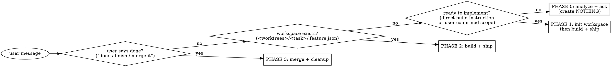

# Workspace mode — an isolated running copy per task

## Overview

Invoked **once**, this skill puts you into **Workspace Mode for the rest of the
session**: every task is built in an isolated git-worktree workspace under
`<worktrees_dir>/<task>/`, and lands in its base branch via a PR. You don't
re-invoke it per step — the conversation drives the phases.

It owns the **environment**, not the change: worktrees, dependency symlinks,
copied env files, ports, detached dev servers, the proxy, the reaper, the admin
dashboard, and the `.feature.json` state that ties them together. Delivering the
change is the `ship` skill; landing it is `merge`.

## When to enter — and when not to

**Enter proactively** the moment a request in a configured workspace turns into
building/changing/fixing something. Configured means there is a
`.claude/feature/config.json` at the root — without it, this skill has nothing to
work with and you should not create one just to have it.

**Do not enter** for:

- read-only questions, code reading, "why does X happen", DB/log inspection, ops;
- a one-off edit the user wants applied where they are, directly on the current
  branch;
- work the user explicitly wants without a PR ("just commit here", "no PR");
- anything outside the configured repos.

**Leaving.** "No workspace", "без воркспейса", "just edit here", "stop using the
worktree" — that ends Workspace Mode **for the session**. Say so in one line and
work in the checkout the user is in, like any ordinary turn. Re-enter only when
they ask for a workspace again. A mode the user cannot leave is a trap, and one
request to leave covers the rest of the session, not one message.

If you're already in Workspace Mode this session, stay in it; don't re-enter. On
first entry run the **Preflight** check below, so a missing tool or an
unauthenticated `gh` surfaces before you start building.

**Core contract:** by the time you hand the user a report, the current pass is
already simplified, reviewed, committed, pushed and reflected in the PR. The
report is the *last* thing you produce, never the first.

## Prerequisite — per-project config

```
<workspace-root>/.claude/feature/config.json
```

This file both **defines the workspace** (its presence marks the root that holds
the repo checkouts and the `worktrees/` tree) and **declares the repos** the
skill can build in. Scripts auto-resolve the root by walking up from the cwd to
the directory that contains it.

Missing when implementation begins ⇒ **create it first** (Phase 0) — see
`references/workspace.md` §0 for the schema, or the plugin's
[configuration doc](../../../../docs/feature/configuration.md). Minimal shape:

```json
{
  "mode": "full",
  "repos": [
    { "name": "api", "base_branch": "main", "port_band": 18000, "frontend": false,
      "deps_symlink": ["venv"], "env_copy": [".env"],
      "dev_start": "venv/bin/python manage.py runserver 0.0.0.0:{port}" },
    { "name": "web", "base_branch": "main", "port_band": 13000, "frontend": true,
      "deps_symlink": ["node_modules"], "env_copy": [".env", ".env.local"],
      "dev_start": "node_modules/.bin/next dev -p {port}" }
  ]
}
```

A repo's **checkout folder name == its `name`**, directly under the workspace
root. One repo is the normal case; several repos are the same config with more
entries, and every phase then spans all of them.

Everything else is policy with a shipped default —
[configuration.md](../../../../docs/feature/configuration.md) is the full list.
Never restate a policy in prose here or enforce one the config turned off.

### Standing instructions and report format (optional)

- `<root>/.claude/feature/INSTRUCTIONS.md` + config `instructions` /
  `repos[].instructions` — rules every pass obeys while writing code. Applied by
  the `ship` skill (its step 0). They are **constraints, not a checklist**, and
  never reported per item. Don't create them proactively.
- `<root>/.claude/feature/report.md` / `summary.md` — what the chat report and
  the dashboard card contain. Loaded by `ship` at the moment it writes them.
  Report format belongs here, never in `INSTRUCTIONS.md`: a format read before
  the work is a format forgotten by the time it's needed.

## Script paths

Every script ships at the plugin root and is shared by all skills:

```bash
SCRIPTS="${CLAUDE_PLUGIN_ROOT}/scripts"
```

They self-anchor to the workspace root (via `.claude/feature/config.json`); pass
`--root "$ROOT"` when you want to be explicit.

## Modes — `lite` (default) vs `full`

`mode` in the config, `full` or `lite`; a `--lite` / `--full` flag from the user
overrides it for the session. Decide once at the start and record it in
`.feature.json` (`"mode"`).

- **lite** — worktree, dependency symlinks, ship, PR. **No ports, no dev servers,
  no FE→BE wiring, no manual-test block.** Needs nothing but git and `gh`, which
  is why it is the shipped default.
- **full** — additionally allocates a unique port, runs the dev server(s), wires
  FE→BE, refreshes the proxy, and gives a pretty `http://<task>.<suffix>` URL
  every pass. Servers start **detached** via `scripts/serve.py` so they outlive a
  one-shot `claude -p` turn, and `scripts/reap.py` (run at the top of every pass)
  caps live servers and tears down workspaces whose PR merged.

Never infer the mode from the task's shape or from phrasing like "quick" — it's
the config's, or an explicit flag's.

## Preflight — verify the toolchain before building

The **first time** you enter Workspace Mode in a session, run the doctor once and
act on what it finds (read-only — safe anytime):

```bash
python3 "${CLAUDE_PLUGIN_ROOT}/scripts/doctor.py"        # add --root "$ROOT" and/or --mode lite
```

It checks git, the GitHub CLI (`gh` **installed and authenticated**), the
workspace config (plus a line naming the standing instructions in force), each
repo's checkout + dependency dirs, and — in full mode — Caddy for pretty URLs.
Every problem is tagged with an owner:

- **`[agent]` — do it yourself now, then continue.** Low-risk, non-privileged
  fixes: create `.claude/feature/config.json` (Phase 0), `brew install gh` if
  missing (say you're doing it).
- **`[user]` — you can't; relay the exact command verbatim** and wait if it's
  blocking: `gh auth login` (interactive), `proxy-setup.sh` (sudo / binds `:80`),
  cloning a missing repo, installing a repo's dev dependencies.

Exit `1` means a `[user]` action blocks building — surface those lines and don't
push ahead on the affected repo. Warnings (dev-server deps, Caddy) are
non-blocking. Re-run after the user reports done; once per session is enough.

## Operating mode — phase detection

On every user message while in Workspace Mode, decide the phase:



- **Phase 0 — Analyze.** Run the Preflight doctor if you haven't this session and
  handle its findings. Understand the request, inspect the relevant repos, ask
  clarifying questions. Ensure `.claude/feature/config.json` exists (create it if
  not — `references/workspace.md` §0). Create nothing else yet. Decide which
  repos are involved and a short kebab-case `<task>` slug.
- **Phase 1 — Init workspace** (lazy, only when implementation actually begins).
  See `references/workspace.md`, then build and ship immediately.
- **Phase 2 — Build + ship** (every subsequent prompt/edit):
  1. **Reap** first, every turn — it's what stops servers and worktrees from
     piling up, and it's cheap and self-throttling:
     ```bash
     python3 "${CLAUDE_PLUGIN_ROOT}/scripts/reap.py" --root "$ROOT"
     ```
     It clears dead PIDs, keeps at most `max_live_servers` live (evicting the
     oldest — worktree and PR stay, only the process stops), and at most once per
     `reap_sweep_age` tears down workspaces whose PRs are **all** merged/closed.
     Workspaces with an open or not-yet-created PR are never touched. If it
     evicted *this* task's server, restart it (`references/workspace.md` §6)
     before handing out URLs.
  2. **Make the change** in the task worktree(s) — ordinary work, no skill needed.
  3. **Invoke the `ship` skill** to deliver it. It auto-detects this workspace
     (`.feature.json` beside the worktree + the config) and therefore uses each
     repo's configured base branch, spans all involved repos, persists
     `summary.md` + stamps the session id for the dashboard, and emits pretty
     `http://<task>.<suffix>/…` test links (lite ⇒ how-to-verify instead).
- **Phase 3 — Merge** (only on explicit user go-ahead). Invoke the **`merge`**
  skill; it syncs the base in, runs the final review, waits for CI, merges per
  `merge.strategy`, and tears the workspace down.

Invoking this skill is the user's pre-authorization for the per-pass commit/push/
PR. The simplify / review / commit rules live in — and are enforced by — `ship`;
don't restate them here.

### Red flags — STOP, you are about to break the contract

- About to **edit, commit or push in a main checkout** (`<workspace-root>/<repo>`)
  or push straight to a base branch → no. All work lives in the task worktree and
  lands via PR.
- Editing a tracked file (e.g. `package.json`) to change the port → no. Use a CLI
  flag / copied env (see `references/workspace.md`).
- Skipping the reap at the top of the turn → no.
- About to merge without an explicit user go-ahead → no. `merge` is user-triggered.
- Staying in Workspace Mode after the user asked to work directly → no.
- Entering the mode for a read-only question → no.

## Repos & ports

Everything is declared in `<workspace-root>/.claude/feature/config.json`:

| Config field | Meaning |
|---|---|
| `mode` | `lite` (default) or `full` — see Modes above |
| `repos[].name` | repo / checkout folder name (directly under the workspace root) |
| `repos[].base_branch` | branch to fork from and PR into |
| `repos[].port_band` | base port; the allocator gives the next free offset per repo (`scripts/ports.py`) |
| `repos[].frontend` | `true` ⇒ this repo owns the bare `http://<task>.<suffix>` alias |
| `repos[].deps_symlink` | dirs to symlink from the main checkout (e.g. `node_modules`, `venv`) — never build caches |
| `repos[].env_copy` | `.env*` files to copy (not symlink) into the worktree |
| `repos[].dev_start` | dev-server command, `{port}` placeholder, relative to the worktree (full mode) |
| `branch` | task-branch naming — `prefix` (default `task-`) or a `{task}` template |
| `instructions[]` | standing rules every pass obeys; `repos[].instructions` scopes them to one repo |
| `considerations[]` | cross-cutting dimensions `ship` validates every pass (mobile, RTL/i18n, …) |
| `simplify` / `code_review` / `pr_feedback` / `commit` / `pr` / `merge` | the gates and their policy — see configuration.md |
| `report` | paths of the chat/summary templates, when you don't use the default locations |
| `proxy.domain_suffix` | URL suffix for pretty URLs (default `localhost`) |
| `proxy.admin_host` / `admin_port` | admin dashboard host/port |
| `max_live_servers` | reaper cap on concurrent dev servers |

In full mode each server is also reachable port-lessly at
`http://<repo>.<task>.<suffix>` (primary frontend at `http://<task>.<suffix>`)
via Caddy — see `references/proxy.md`.

## Phase playbooks

- **Init:** `references/workspace.md` — config schema (§0), worktree creation,
  dependency symlinks, `.env` copy, port allocation, running on the unique port,
  FE→BE wiring, `.feature.json` state.
- **Ship:** the `ship` skill — simplify → review → commit → push → PR → report.
- **Merge:** the `merge` skill — sync base into the task branch, final review,
  green CI, merge per strategy, full cleanup.
- **Pretty URLs:** `references/proxy.md` — `http://<task>.<suffix>` via Caddy on
  `:80` (full mode). One-time setup: `scripts/proxy-setup.sh`; per-task reload is
  sudo-free.
- **Admin dashboard:** `references/admin.md` — launch with **`/feature-admin`**
  (or `scripts/admin.py`); a live view of every workspace (repos, PRs+CI,
  dev-server health & logs, summary, `claude --resume` command) at
  `http://<admin_host>`.

## Common mistakes

- Creating the workspace during Phase 0 — wait until implementation actually starts.
- Symlinking `.next`/build caches — those must be per-worktree (symlink only the
  configured `deps_symlink`).
- Forgetting that one task can span several repos — init, ship and merge must
  cover **all** involved repos.
- Re-creating an existing worktree — if `.feature.json` exists, resume from it.
- Leaving dev servers running or ports allocated after the merge.
- Starting a dev server with a bare `cmd &` instead of `scripts/serve.py` — under
  a one-shot `claude -p` turn it dies when the turn ends.
